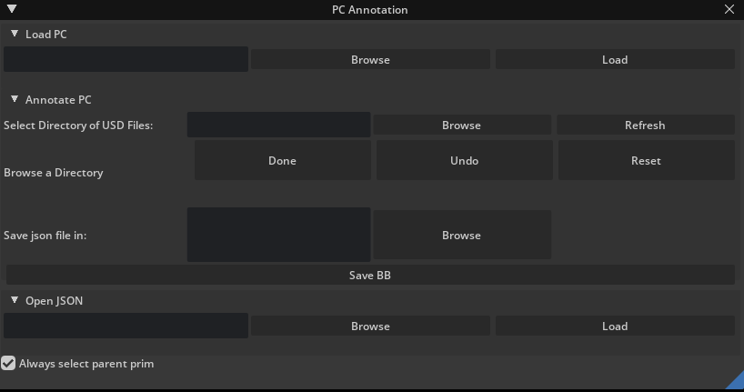
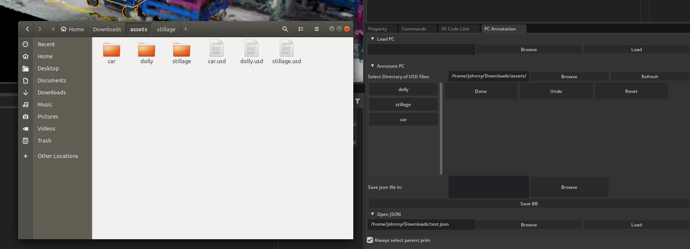
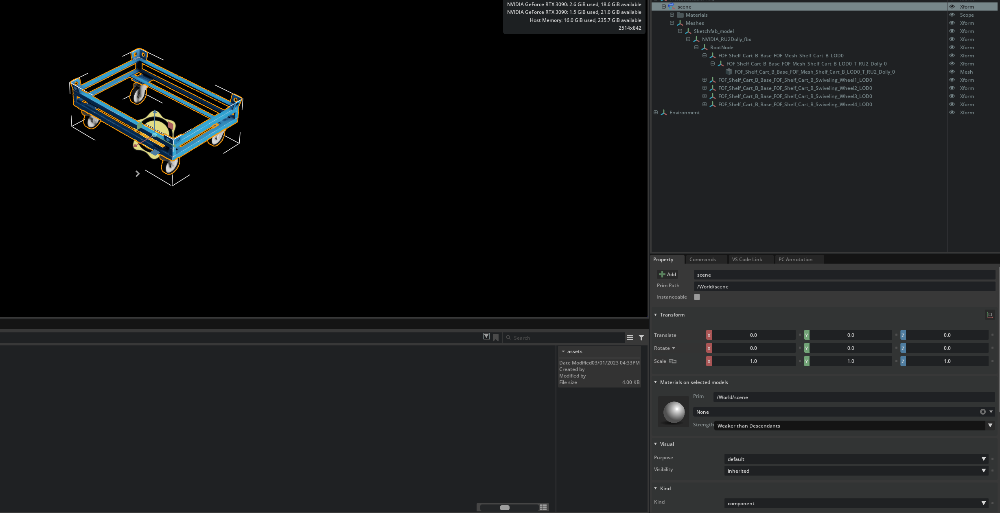
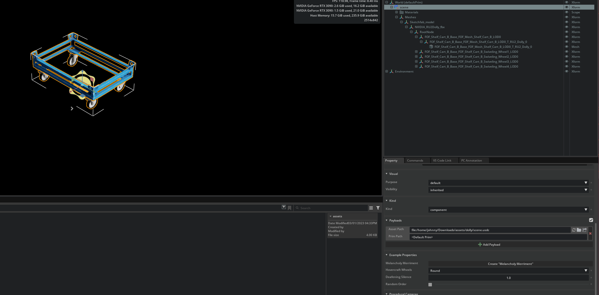

# Point Cloud Annotation Extension

This repository allows you to generate point clouds into a scene and annotate them with USD Files. It is also capable of loading the USD files after saving their places in a specific scene.

# Prerequisites

- Windows or Ubuntu
- Omniverse

# Set Up the extension:

- Clone the repository
- Launch Omniverse
- Go to `Extensions` section
- Click on the `gear` icon
- On the rigth you can see a `➕` sign
- After clicking on it, you can set the directory path of the repositary located on your PC.
Note that in our case, the directory path should end with `aipipeline-pointcloud-annotation-ext/exts`
- You should afterward activate the extension by clicking on Third Party section and search for `company.hello.world`
- The extension window will apear in omniverse and it should work fine.

# Feature details of the extension:

**Load PC section:**

- Browse a scene of type `.ply`
- Load point clouds in the scene

**Annotate PC section:**

- Browse a directory that contain USD files.
- Buttons will be displayed if there is USD files in the directory and set the button name as per the file name.
- There is 3 Buttons to use when placing an object:
    - `Done` clicked after placing a prim in order to place another one.
    - `Undo` if you wish to unplace the object. Doesn't work after clicking `Done` button, you will need to delete object from stage.
    - `Reset` if you want to unplace all the prims that you have set in your scene
- Object will be created at the perspective camera's location

- A folder `Scope` will be created after placing an object in the scene and will store all the objects of the scene
- After placing all your prims in the location that you desire, you can now browse for a `.json` file or enter a json file name to save the location of your prims by clicking the `Save BB` button.

**Open JSON section:**

- If you have saved your object location in a json file, you can import them back in your scene by openning the json file that correspond to those objects.

**The Parent Prim Checkbox:**

- This is a checkbox located at the bottom left of the window. It is advised to let it checked when using this extension since it helps you always in selecting the parent prim of a USD File object.
- If you click on the object in the scene, instead of getting a child prim of the object and move its location, you will get the toppest prim.

# Be Aware of:

- Any change in the child prims of an object will not be saved in the json file. **That's why you should always select the parent prim of an object to relocate it in the scene.**
- Your USD files should be named as per the object that is present in their scene.

- **The top parent prim of your object should always has a default translate, rotate of 0.**
    - **ex**: dolly.usd file has one object dolly that is located at Translate(0, 0, 0) with Rotation(0, 0, 0)

- Each USD File contain one object of a single type or class which is referenced to a scene.usdc file.

- Best practice is to save all your assets in a same directory
- You can see your objects added in the `Stage` window inside the `/World/Scope` folder.
- In case you turned off the checkbox, make sure that you're always selecting the parent prim when relocating the object **(Not Recommended)**
- After you have finished your work with the extension, you can turn off the checkbox.
- You can test your annotation using the labelCloud repositary `(https://github.com/ch-sa/labelCloud)` that helps you to locate the bounding boxes of your objects in the scene.

# Authors

- **Johnny Al Asmar**
- **Anthony Yaghi**